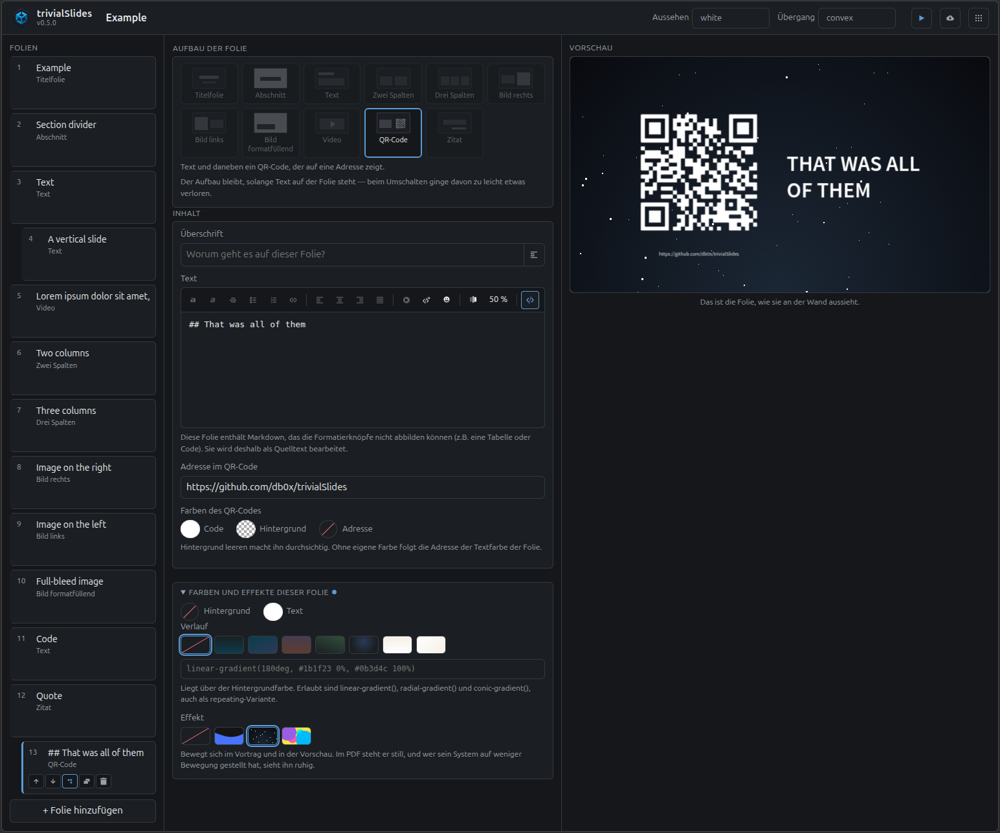

# trivialSlides


```
  __      _      _      _________    __      
 / /_____(_)  __(_)__ _/ / __/ (_)__/ /__ ___
/ __/ __/ / |/ / / _ `/ /\ \/ / / _  / -_|_-<
\__/_/ /_/|___/_/\_,_/_/___/_/_/\_,_/\__/___/
                           based on revealJS   
```

**trivialSlides** is a presentation editor built on reveal.js, made usable
by people who do not want to write Markdown — and it still stores nothing
but Markdown.

The name is the promise: no database, no build step, no accounts. One folder
per talk, one Markdown file inside it, done.

The editor is a **view** onto a `.md` file, not its owner. You can work
around it at any time: open the file in a text editor, put it under version
control, copy it into an existing reveal.js project. Those who prefer typing
type. Those who prefer clicking click. Both work on the same file.



## Getting started

```bash
cp .env.example .env        # adjust the port and where decks are kept
docker compose up -d
```

Then open `http://127.0.0.1:8080` in a browser — or whichever port you set
in `.env`. The container is called `trivialSlides`, so `docker logs -f
trivialSlides` shows you what it is doing. (The *service* in the compose
file is lower-case `trivialslides` — that is the name for `docker compose`
commands, while Docker itself addresses the container by the capitalised
one.)

Two things to watch when picking a port, both quickly explained:

* Browsers refuse a handful of ports outright and report `ERR_UNSAFE_PORT`
  — among them the IRC block `6665–6669` plus `6679` and `6697`. The server
  runs perfectly well in that case, it is just that nobody knocks.
* `BIND_ADDR=127.0.0.1` listens on IPv4 only. If `localhost` resolves to
  IPv6 first on your machine and the browser does not fall back, use
  `127.0.0.1` directly.

To let colleagues on the same network join in, set `BIND_ADDR=0.0.0.0` in
`.env`.

It also runs without Docker:

```bash
cd backend && npm install && npm start
```

## What it looks like

Three areas: the slides as a list on the left (drag to reorder), the form
for the selected slide in the middle, a live preview running real reveal.js
on the right — not a replica, but exactly what will be on the wall later.

The form shows no Markdown syntax anywhere: the layout as a clickable tile,
a field for the heading, a text field with buttons for
bold/italic/list/link, plus image and attribution. What those buttons
produce lands in the file as perfectly ordinary Markdown.

Colour, gradient and animated background sit in a group of their own at the
foot of the form, and that group starts **folded**. They are what one
reaches for after a while, not at the start, and a first slide should not
open onto a wall of settings. Whoever unfolds it once keeps it unfolded --
the choice lives in the browser, like the light/dark setting, because it
belongs to the person and not to the deck. A slide that carries any of them
says so with a dot on the folded label, so nothing can hide in there
unnoticed.

## The layouts

| Layout | What for |
|---|---|
| Title slide | Large title centred, subtitle or speaker below |
| Section | Divider between two topics, often with a coloured background |
| Text | Heading and body — the common case |
| Two columns | Like text, but the body runs in two columns |
| Three columns | The same in three, at a smaller type size — for short points |
| Image right / left | Text and image side by side |
| Full-bleed image | Image across the whole slide, text readable on top |
| Video  | A heading with a YouTube player below it |
| QR-code  | slide with QR-code generated from URL and text |
| Quote  | Large quotation with an attribution |

## The storage format

One folder per deck:

```
decks/quartalsbericht/deck.md
decks/quartalsbericht/assets/team.jpg
```

The folder is the unit you send or back up — Markdown and images together,
the image paths relative.

The file is compatible with reveal.js and `reveal-md`:

## Video on a slide

The *video* layout embeds a YouTube player. The editor's field takes
whatever is in the clipboard — a watch link, a youtu.be link, /shorts/,
/embed/, or the bare id — and what the file stores is the **id alone**:

## Background gradients

A slide takes a CSS gradient besides its background colour — the editor
offers swatches to click and, below them, a field for writing one by hand:


## Animated backgrounds

Besides a colour and a gradient a slide takes an *effect*. Both are taken
from a CodePen and reproduced rather than adapted:

| Effect | |
|---|---|
| `waves` | Three near-black discs, far larger than the slide, hanging in from above so that only the bottom of their rim is on show, each turning at its own speed. A turning rim rises and falls, which is the movement of water; three at different speeds are what keep it from reading as one turning disc. On its own blue ground. |
| `starfield` | Three star fields drifting upwards at three speeds — near stars quickly, far ones slowly, which is what makes the sky look deep. A field is a single pixel wearing a few hundred box-shadows, on a night-sky gradient. |
| `blobs` | Four shapes turning about two points, one pair in the upper left, one in the lower right, each of the pair at its own speed so they drift apart and together again. On yellow, and loud with it. The drawing is an inline SVG; its viewBox is smaller than the shapes on purpose, so they hang over the edges of the slide rather than sitting in it. |

## Code on a slide

A fenced code block in the Markdown comes out coloured — reveal.js' own
highlighter (highlight.js) does the work, and the language is whatever the
fence says:

```java hl=github
public int getAge() {
    return this.age;
}
```

## Licence

[MIT](LICENSE) — take it, change it, pass it on, commercially too; the
copyright notice has to come along.

Every dependency is permissively licensed as well (MIT, ISC, Apache-2.0,
BSD-3-Clause), none of them demands copyleft. reveal.js and
OverlayScrollbars are both MIT too and are only served here as static
files. For the planned move into Relay
that is the right direction: MIT code may travel into an AGPL project, the
other way round it could not.
